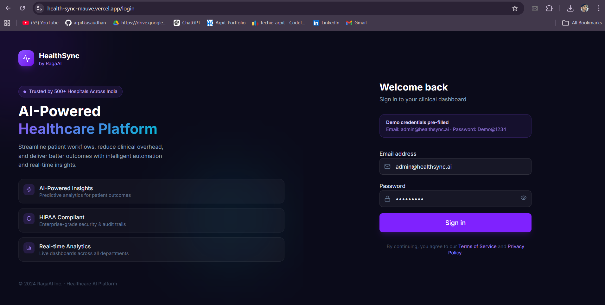
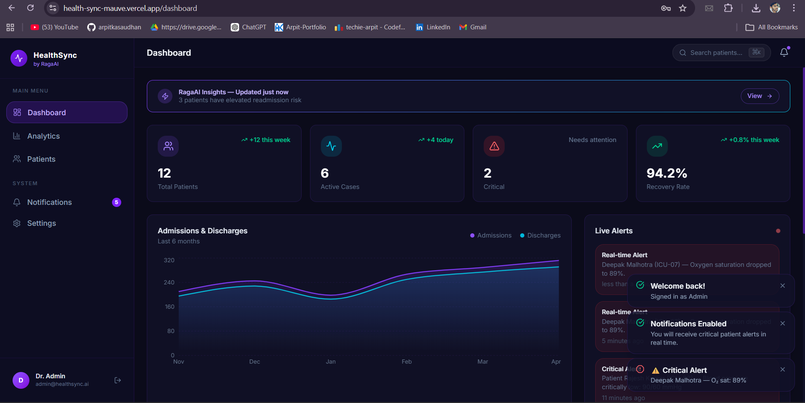
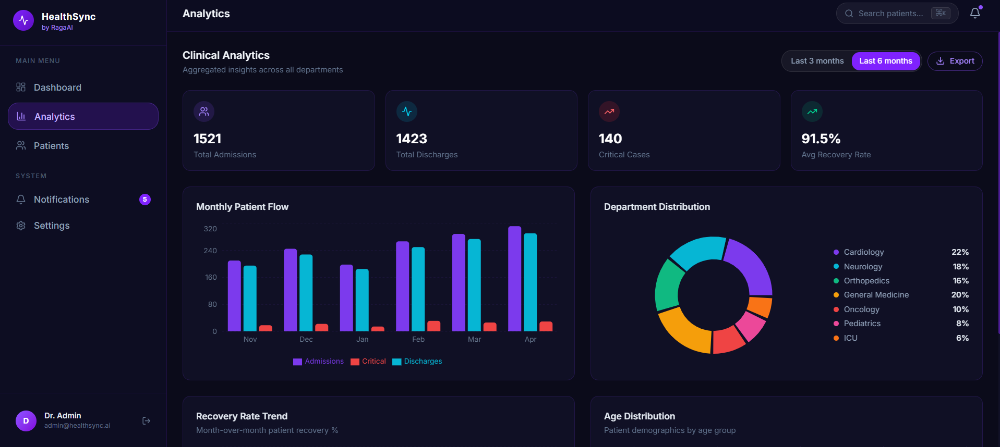
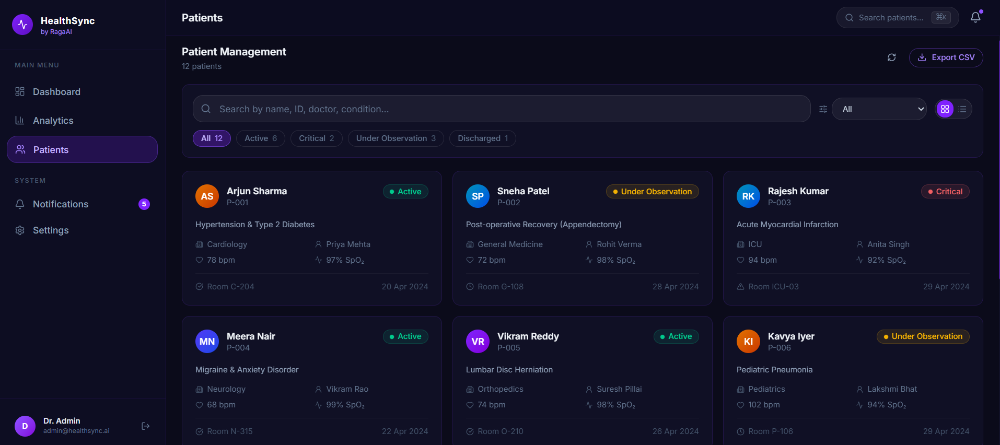
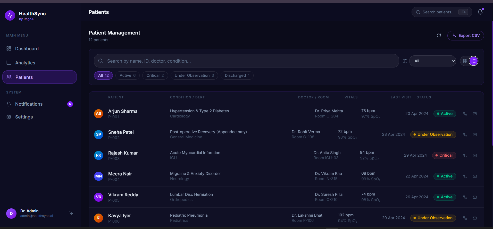
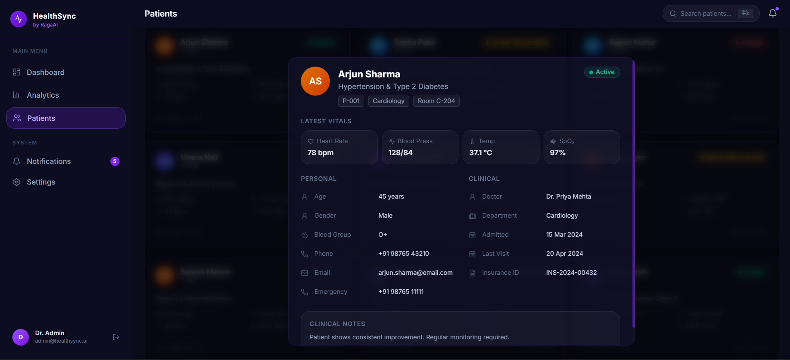
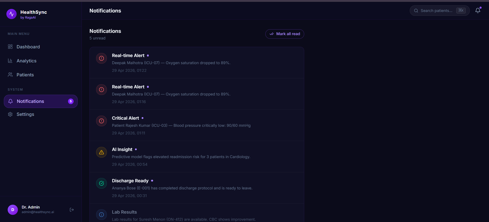

<div align="center">


<br /><br />

# HealthSync — by RagaAI

### A B2B Healthcare SaaS Platform with AI-powered insights, real-time alerts, and rich clinical workflows

**[🚀 Live Demo](https://health-sync-mauve.vercel.app/login)** · Built for the RagaAI SDE-1 Frontend Assignment

<br />

</div>

---

## 📸 Screenshots

> **Demo credentials** — pre-filled on the login page:
> - **Email:** `admin@healthsync.ai`
> - **Password:** `Demo@1234`

<br />

### Login Page

> Split-panel login with RagaAI branding, feature highlights, form validation, and password toggle.

<br />

### Dashboard

> KPI cards, live admissions/discharges area chart, real-time alert feed, AI insights panel, and recent patients list.

<br />

### Analytics

> Monthly patient flow bar chart, department distribution pie chart, recovery rate trend line, age group distribution — all with a 3m/6m date range toggle and one-click CSV export.

<br />

### Patient Management — Grid View

> Card-based patient grid with vitals, status badges, department, and doctor info at a glance.

<br />

### Patient Management — List View

> Compact table view with inline call/email actions, sortable columns, and status chips.

<br />

### Patient Detail Modal

> Full clinical profile — vitals with alert highlighting, personal info, insurance ID, clinical notes, and admission history.

<br />

### Notifications Panel

> Real-time alerts slide in from the right. Critical alert automatically fires 8 seconds after login to demonstrate live service worker notifications.

---

## ✨ Features

### Core (Assignment Requirements)

| Feature | Detail |
|---|---|
| 🔐 **Firebase Authentication** | Email/password login with session persistence. Demo mode bypasses Firebase — works out of the box |
| 🏠 **Dashboard** | KPI stats, area chart, live alerts feed, AI insights |
| 📊 **Analytics Page** | 4 chart types — bar, area, pie, line — with date range filter |
| 🧑‍⚕️ **Patient Details** | Grid view + List view with a toggle switch |
| 🔔 **Service Worker** | Registered on load; requests OS notification permission; real-time critical alert fires at 8 s |
| 🗂️ **State Management** | Redux Toolkit with 3 slices, typed hooks, and `createSelector` memoisation |

### Bonus & Extra (Assessment Advantages)

- **AI Insights panel** — predictive readmission risk and capacity warnings, branded as "RagaAI Insights"
- **Real-time notification simulation** — critical O₂ alert triggers Redux state + toast + OS push notification simultaneously
- **Patient Detail Modal** — vitals with contextual alert highlighting (red when abnormal), full clinical profile
- **Advanced filtering** — search across name / ID / doctor / condition + status chips + department dropdown
- **CSV Export** — one-click export on both Analytics and Patients pages
- **Code splitting** — lazy-loaded routes keep initial bundle small
- **Glassmorphism dark UI** — RagaAI purple brand identity, custom scrollbars, hover-lift cards
- **Fully responsive** — collapsible sidebar with mobile hamburger menu
- **Skeleton loaders** — built and ready for async data integration
- **12 realistic patients** — full vitals, insurance IDs, clinical notes, emergency contacts

---

## 🏗️ Architecture

```
src/
├── components/
│   ├── layout/            # AppLayout, Sidebar, Topbar, NotificationPanel
│   └── ui/                # Button, Input, Badge, Avatar, Modal, Skeleton, Toast
├── features/
│   ├── auth/              # LoginPage
│   ├── dashboard/         # DashboardPage
│   ├── analytics/         # AnalyticsPage
│   ├── patients/          # PatientsPage, PatientDetailModal
│   └── notifications/     # NotificationsPage
├── store/
│   ├── index.ts           # Redux store (configureStore)
│   └── slices/
│       ├── authSlice.ts          # User auth state + localStorage persistence
│       ├── patientSlice.ts       # Patient list, view mode, filters + createSelector
│       └── notificationSlice.ts  # Notifications, toasts, panel state
├── hooks/
│   ├── redux.ts           # Typed useAppDispatch / useAppSelector
│   ├── useAuth.ts         # Login / logout logic
│   └── useNotifications.ts # SW registration + real-time alert demo
├── services/
│   ├── firebase.ts        # Firebase Auth (with demo bypass)
│   └── notifications.ts   # SW registration, Notification API helpers
├── data/
│   └── mockData.ts        # 12 patients, analytics data, notifications
├── types/
│   └── index.ts           # Shared TypeScript interfaces
└── utils/
    └── helpers.ts         # cn(), formatDate(), statusColor(), exportToCSV()
public/
└── sw.js                  # Service Worker — caching + push + notificationclick
```

---

## 🛠️ Tech Stack

| Layer | Choice | Why |
|---|---|---|
| Framework | React 18 + TypeScript | Type safety, component model |
| Build tool | Vite 8 | Sub-second HMR, native ESM |
| State | **Redux Toolkit** | Slices, immer, createSelector, devtools |
| Routing | React Router v6 | Nested layouts, lazy loading |
| Styling | Tailwind CSS v4 | Utility-first, zero runtime |
| Charts | Recharts | Composable, React-native |
| Auth | Firebase Authentication | Industry-standard, HIPAA-ready |
| Notifications | Service Worker + Notification API | Native OS alerts |
| Icons | Lucide React | Consistent, tree-shakeable |
| Date utils | date-fns | Lightweight, modular |
| Deployment | Vercel | Edge CDN, zero-config |

---

## 🚀 Getting Started

### Prerequisites

- Node.js 18+
- npm 9+

### 1 — Clone & install

```bash
git clone https://github.com/YOUR_USERNAME/healthsync.git
cd healthsync
npm install
```

### 2 — Environment variables (optional)

The app works in **demo mode** without any Firebase config. To connect a real Firebase project:

```bash
cp .env.example .env
# Fill in your Firebase credentials in .env
```

### 3 — Run locally

```bash
npm run dev
# → http://localhost:5173
```

### 4 — Build for production

```bash
npm run build
npm run preview
```

---

## 🔐 Authentication

| Mode | How it works |
|---|---|
| **Demo** | Login with `admin@healthsync.ai` / `Demo@1234` — no Firebase project needed |
| **Firebase** | Add credentials to `.env` — real email/password auth via Firebase |

Session is persisted in `localStorage` via the Redux `authSlice`.

---

## 🔔 Service Worker & Notifications

1. SW is registered at `/sw.js` on app load
2. Permission prompt appears 2.5 s after login (better UX than immediate)
3. **8 seconds after login**, a simulated critical alert:
   - Dispatches to Redux (`notificationSlice`)
   - Shows a slide-in toast
   - Fires an OS-level push notification (if permission granted)
4. SW handles `push`, `notificationclick`, and `fetch` (cache-first for static assets)

---

## 📊 State Management (Redux Toolkit)

Three slices power the entire app:

```
authSlice         → user, loading, error  (persisted to localStorage)
patientSlice      → patients[], viewMode, filters, selectedId
notificationSlice → notifications[], toasts[], panelOpen
```

All selectors are memoised with `createSelector`. Typed `useAppDispatch` and `useAppSelector` hooks prevent any `any` types at the boundary.

---

## 🌐 Deployment

Deployed on **Vercel** at [https://health-sync-mauve.vercel.app](https://health-sync-mauve.vercel.app/login)

To deploy your own:

```bash
# Install Vercel CLI
npm i -g vercel

# Deploy
vercel --prod
```

No environment variables are required for the demo to work.

---

## 👤 Author

Built for the **RagaAI SDE-1 Frontend Developer Assignment**

---

<div align="center">

Made with ❤️ using React + Redux Toolkit + RagaAI's design language

</div>
